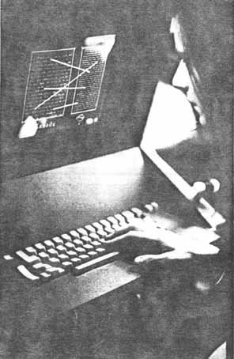

Bienvenue dans mon carnet de traduction. Je suis Charlotte Lebon, doctorante en Littératures et langues du monde, option Humanité numériques à l'Université de Montréal. Mon sujet de recherche est le suivant : Comment l’éditorialisation de la « traduction transparente » d’une œuvre multilingue, en réduisant le phénomène d’invisibilisation du processus de traduction, renouvelle-t-elle la traduction des dialectes en français ?
Pour creuser cette réflexion, je souhaite travailler la notion de "traduction transparente" à l’ère numérique et développer une édition numérique savante, collaborative et enrichie de l’œuvre italo-napolitaine *Il ventre di Napoli*, _Le Ventre de Naples_, de Matilde Serao./
Je vous propose donc ce carnet qui comportera mes réflexion de recherche, des récits de traducteurs, des expérimentation de traduction, tout ce qui rend visible la traduction en train de se faire./
Bon parcours à travers les langues !

<!--l'image ci-dessous se trouve dans le dossier static/images-->

<!-- si jamais je souhaite afficher l'image du post1, le code est le suivant : 

et si jamais je souhaite afficher l'image logo du site, le code est le suivant : 

-->
